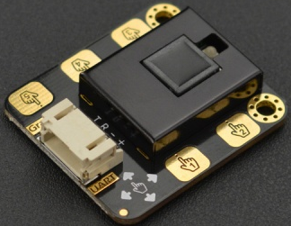

# 手势识别带触摸传感器	

 手势识别带触摸传感器	(测试)

 

# 用户库教程
 

教程链接：[Mind+官方文档](http://wiki.dfrobot.com.cn/index.php?title=(SKU:SEN0285)_Gesture%26Touch_Sensor_V1.0%E6%89%8B%E5%8A%BF%E8%AF%86%E5%88%AB%E5%8F%8A%E8%A7%A6%E6%91%B8%E4%BC%A0%E6%84%9F%E5%99%A8).

---------------------------------------------------------

# 123456
# 345668

